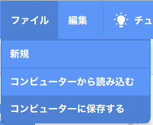
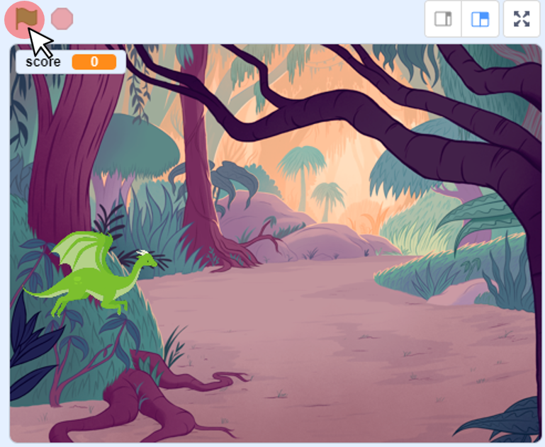
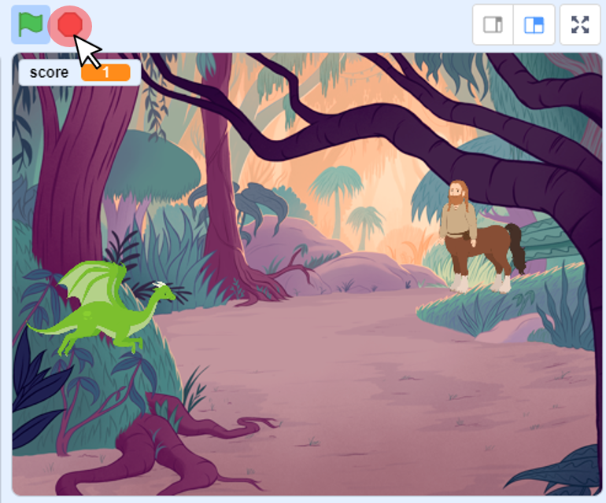

# 1.はじめに(Introduction)

このドキュメントでは、[Scratch 3.0](https://scratch.mit.edu/download)を使ったゲーム[monsters_v1](https://github.com/jincho-ntttx/monsters_v1)をバージョンアップする方法を説明します。

This document describes how to update monsters_v1 using [Scratch 3.0](https://scratch.mit.edu/download).

ドキュメント作成者：今井　聡(NTTテクノクロス株式会社)

Document Author：Satoshi Imai(NTT TechnoCross Corporation)

## バージョンアップ内容
1. ゲーム開始・終了(Add game start and end)
2. 攻撃を貫通させない(make not penetrate attack)
3. 敵の移動速度をランダムにする(make random movement of enemy)

# 2.準備:
##  前提条件
**このドキュメントでは前提条件として、monsters_v1がすでにできていることとします。**

もしmonsters_v1を作成していない場合は先に、[こちらからmonsters_v1](https://github.com/jincho-ntttx/monsters_v1)を作成してから実施してください。

This document assumes monsters_v1 has been completed.

 If you don't make monsters_v1,please make [monsters_v1](https://github.com/jincho-ntttx/monsters_v1).

# 3. 作り方(How to develop)

このゲームは、以下の流れで作成します。

This game consists of the following three programs.

1. ゲーム開始・終了(Add game start and end)
2. 攻撃を貫通させない(make not penetrate attack)
3. 敵の移動速度をランダムにする(make random movement of enemy)

ここでは、書くプログラムの作り方を説明します。

以下表のプログラム名をクリックすると、プログラムの説明が表示されてます。

プログラムは **『ゲーム開始・終了→攻撃を貫通させない→敵の移動速度をランダムにする』の順番で作成** します。

In this section, i will explain how to make each program.

Click on a program name in the table below to see a description of the program.

Develop the program in the order of "add game start and end -> make not penetrate attack -> make random movement of enemy".

| プログラム名(Program name) | 概要(Overview) |
|:----|:----|
| [ゲーム開始・終了](make_start_end.md) | ゲーム開始・終了処理追加の説明(Add game start and end program description) |
| [攻撃を貫通させない](make_attack.md) | 攻撃を貫通させないのプログラムの説明(Not penetrate attack's program description) |
| [敵の移動速度をランダムにする](make_random_enemy.md) | ステージのプログラムの説明(Random movement of enemy's program description) |

# 4.プログラムの保存方法

Scrachのファイルのメニューから『コンピューターに保存する』を選択し、実行してください。

From the Scrach file menu, select "Save to computer" and run it.

# 5. プログラムの実行・停止方法(How to run and stop the program)

## 5-1. プログラムを実行(Run the program)

旗のボタンを押してください。

Press the flag button.

## 5-2. プログラムを停止(Stop the program)

赤いボタンを押してください。

Press the red button.

