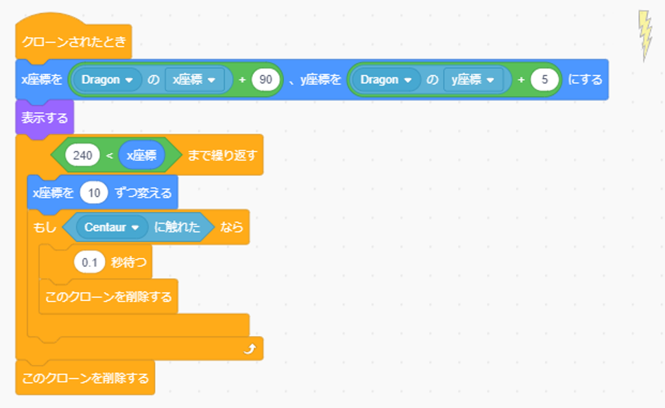
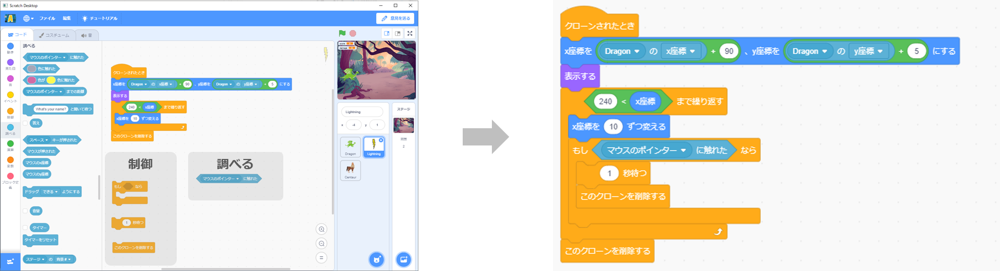
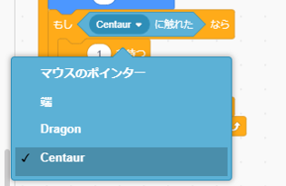
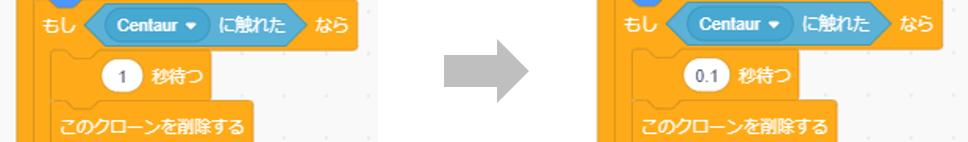

# ゲーム開始・終了の追加(How to make not penetrate attack)

## 前提(Premise)
**[ゲーム開始・終了の追加](make_start_end.md)のプログラムが完成** していること。

  **[Game start&end's program](make_start_end.md)** is complete.

## 完成イメージ(Completed image)
- Lightningのスプライト

    Compleate Lightning sprite.

# プログラムの作り方(How to develop a program)
## Lightningの変更(How to change Lightning)
- Lightningのスプライトで以下の図の通り、カテゴリごとのブロックをドラック&ドロップし、ブロック同士をつなげる。

    In Lightning sprite. As shown in the figure below, drag and drop blocks for each category to connect the blocks.

- マウスのポインターの右側にある▼ボタンを押し、[Centaur]を選択する。

    Press the ▼ button on the right side of "マウスのポインター" to select the "Centaur".

- - ブロックの数字をダブルクリックし、0.1に変更する。

    Double-clicking on a number and change the number to 0.1.

- これでLightningのプログラムは完成です。

    Lightning program is complete.
