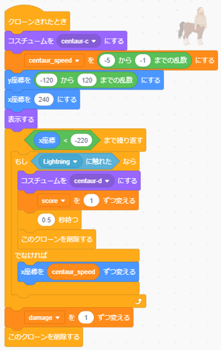
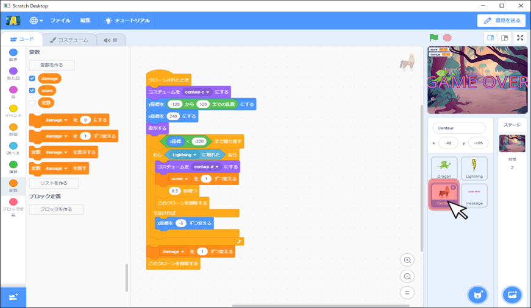
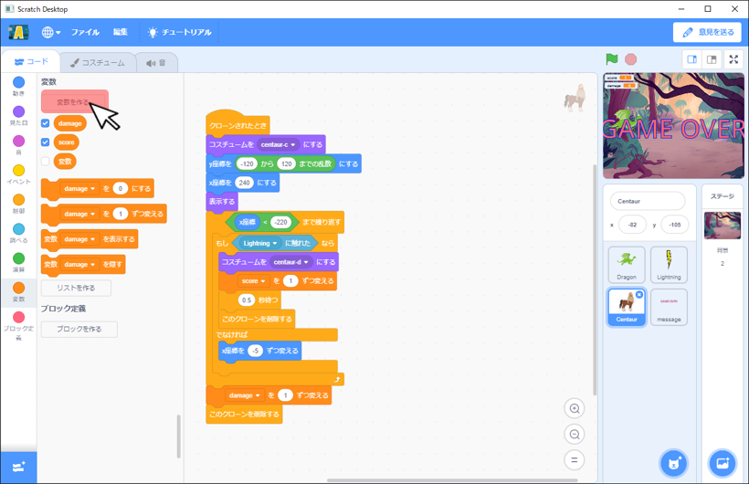
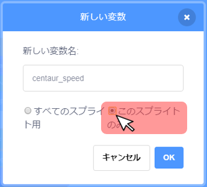
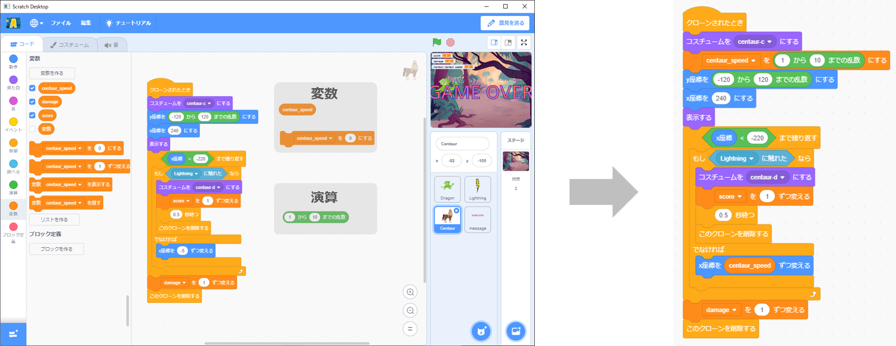
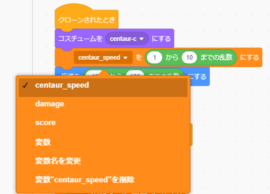

# 敵の移動速度をランダムにする(How to make random movement of enemy)

## 前提(Premise)
**[攻撃を貫通させない](make_attack.md)のプログラムが完成** していること。

  **[Not penetrate attack's program](make_attack.md)** is complete.

## 完成イメージ(Completed image)
- Centaurのスプライト

    Compleate Centaur sprite.

# プログラムの作り方(How to develop a program)
## Centaurの変更(How to change centaur)
- Centaurのスプライトで[このスプライトのみ]の変数[centaur_speed]を追加する。([変数を作る]→[このスプライトのみ]にチェックをいれる。→[centaur_speed]変数を作成)

    Add new variable only in Centaur sprite."変数を作る"→check "このスプライトのみ"→create variable named "centaur_speed"

- Centaurのスプライトで以下の図の通り、カテゴリごとのブロックをドラック&ドロップし、ブロック同士をつなげる。

    In Centaur sprite. As shown in the figure below, drag and drop blocks for each category to connect the blocks.

- 追加した[centaur_speed]を(~までの乱数)にするが[centaur_speed]になっていることを確認する。

    なっていなかった場合は▼を押して[centaur_speed]に変更する。

    Confirm the "[centaur_speed]を(~までの乱数)にする" block become "centaur_speed".

    If the block doesn't become "centaur_speed", press the ▼ button to select the "centaur_speed".

- [centaur_speed]の乱数を(-5)から(-1)に変更する。

    Change centaur_speed's random number ranges from -5 to -1.

- これで敵の移動速度をランダムにするプログラムは完成です。

    Random movement of enemy program is complete.
