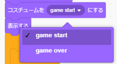
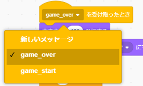
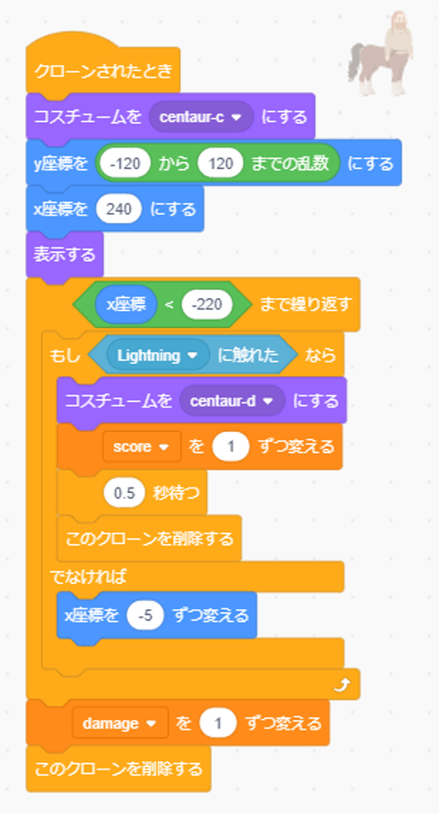

# ゲーム開始・終了の追加(How to add game start and end)

## 前提(Premise)
このドキュメントでは前提条件として、monsters_v1がすでにできていることとします。

もしmonsters_v1を作成していない場合は先に、[こちらからmonsters_v1](https://github.com/jincho-ntttx/monsters_v1)を作成してから実施してください。

This document assumes monsters_v1 has been completed.

 If you don't make monsters_v1,please make [monsters_v1](https://github.com/jincho-ntttx/monsters_v1).

## 完成イメージ(Completed image)
- ステージのスプライト

    Compleate Stage sprite.

- messageのスプライト

    Compleate Message sprite.

- Centaurのスプライト

    Compleate Centaur sprite.

# プログラムの作り方(How to develop a program)
## ステージの変更(How to change Stage)
- 変数[damage]を追加する。([変数を作る]→[damage]変数を作成。)

    Add new variable.("変数を作る" → create variable named "damage" )

- [ずっと]のブロックを[(　)まで繰り返す]に置き換える

    Replace [ずっと] with [(　)まで繰り返す]

- ステージのスプライトで以下の図の通り、カテゴリごとのブロックをドラック&ドロップし、ブロック同士をつなげる。

    In Stage sprite. As shown in the figure below, drag and drop blocks for each category to connect the blocks.

- メッセージ1の右側にある▼ボタンを押し、[新しいメッセージ]を選択。

    新しいメッセージとして[game_start]を作成する。

    Press the ▼ button on the right side of "メッセージ1" to select the "新しいメッセージ".

    Make "game_start" as new message.

- [[score]を(0)にする]、[[damage]を(0)にする]が作成されている事を確認する。

    Confirm maked "[score]を(0)にする" and "[damage]を(0)にする".

- ブロックの数字をダブルクリックし、3に変更する。

    Double-clicking on a number and change the number to 3.

- メッセージ1の右側にある▼ボタンを押し、[新しいメッセージ]を選択。

    新しいメッセージとして[game_end]を作成する。

    Press the ▼ button on the right side of "メッセージ1" to select the "新しいメッセージ".

    Make "game_end" as new message.

## messageのスプライトの作成(How to make message sprite)
- スプライトを新規に追加する。(スプライト追加ボタン[描く]→game start時に出したいメッセージを描く)

    Add new sprite. Draw game start message.

- コスチューム名を[game start]に変更する。

    Change the costume name to "game start".

- コスチュームを追加する。(コスチュームの追加ボタン[描く]→game overの時に出したいメッセージを描く)

    Add new costume. Draw game over message.

- コスチューム名を[game over]に変更する。

    Change the costume name to "game over".

- スプライト名を[message]変更する。

    Change the sprite name to "message".

- コードのタブに移動する。

    Go to tab named "コード".

- messageのスプライトで以下の図の通り、カテゴリごとのブロックをドラック&ドロップし、ブロック同士をつなげる。

    In message sprite. As shown in the figure below, drag and drop blocks for each category to connect the blocks.

### game_startブロックの作成(How to make game_start block)
- game_startのブロックは最後に[隠す]ブロックのある方で作成する。

    The game_start block is created with the block has "隠す" at last.

- game_endの右側にある▼ボタンを押し、[game_start]を選択する。

    Press the ▼ button on the right side of "game_end" to select the "game_start".

- game_startになっている事を確認する。なっていなかった場合は▼ボタンを押し、[game_start]を選択する。

    Confirm "game start". If the block doesn't become "game start", press the ▼ button to select the "game start".

- ブロックの数字をダブルクリックし、5に変更する。

    Double-clicking on a number and change the number to 5.

- ブロックの数字をダブルクリックし、0.1に変更する。

    Double-clicking on a number and change the number to 0.1.

- ブロックの数字が10になっている事を確認する。なっていなかった場合はブロックの数字をダブルクリックし、10に変更する。

    Confirm the number become 10.If the number doesn't become 10, double-clicking on a number and change the number to 10.

### game_endブロックの作成(How to make game_end block)
- game_endのブロックは最後に[隠す]ブロックがない方で作成する。

    The game_end block is created with the block doesn't have "隠す" at last.

- game_overになっている事を確認する。なっていなかった場合は▼ボタンを押し[game_over]を選択する。

    Confirm "game_over". If the block doesn't become "game_over", press the ▼ button to select the "game_over".

- game_startの右側にある▼ボタンを押し、[game over]を選択する。

    Press the ▼ button on the right side of "game_start" to select the "game over".

- ブロックの数字をダブルクリックし、5に変更する。

    Double-clicking on a number and change the number to 5.

- ブロックの数字をダブルクリックし、0.1に変更する。

    Double-clicking on a number and change the number to 0.1.

- ブロックの数字が10になっている事を確認する。なっていなかった場合はブロックの数字をダブルクリックし、10に変更する。

    Confirm the number become 10.If the number doesn't become 10, double-clicking on a number and change the number to 10.

- 左上の画面で作成したメッセージの位置をドラック&ドロップで調整する。

    The message ajust by dragging and dropping at top left screen.

## Centaurのスプライトの作成(How to change Centaur sprite)
- [このクローンを削除する]の直前に[(damage)を(1)ずつ変える]を追加する。  
Centaurが画面の端までいくとダメージを受けます。

    Add "(damage)を(1)ずつ変える" just before "このクローンを削除する".

- これでゲーム開始・終了の追加は完成です。

    Game start&end program is complete.
